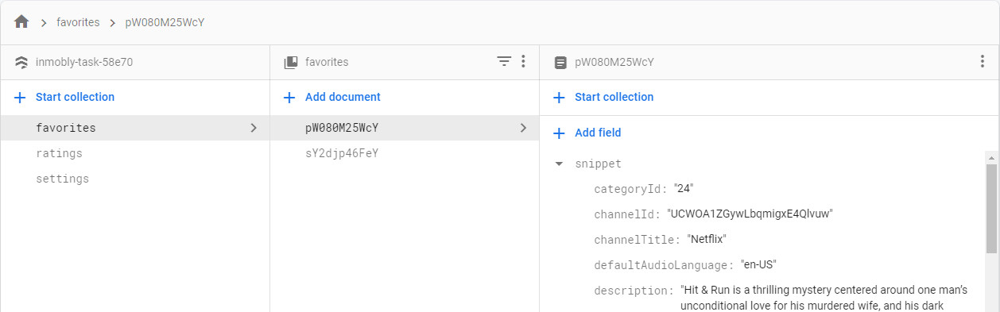

# InMobly Task
Implement a **SPA** single page application displaying list of videos in a YouTube channel

---
**All project code has comments explaining what i'm doing*

**Could not use minification using gulp or grunt as i'm using Angular 11 and it automatically does the minification on build*

## Run
Run `ng serve` for a dev server. Navigate to `http://localhost:4200/`

## Offline run
The project utilizes the **Service Worker** and **LocalStorage** to make the app available offline.

To run the project on offline mode, run the build command `ng build --prod`, then install the `live-server` NPM package if its not installed already, and then run the following command `http-server -p 8080 -c-1 .\dist\inmobly-task\` in the project **root** folder

This will run the **Service Worker** production version of the project.

**Please make sure that the Service Worker is registered and working properly from the chrome developer tools*

## Project Structure
	app/
	├── pages/
	│   ├── details
	│   ├── favorites
	│   └── home
	└── shared/
	    ├── models
	    ├── pipes
	    └── services/
	        ├── db
	        ├── network
	        └── youtube

The **pages** folder contains all the 3 screens components
1. **Details** screen: Displays the details of the selected video, with the ability to add to favorites and rating
2. **Favorites** screen: Displays all the favorited videos, and the ability to delete them
3. **Home** screen: Displays a list of channel videos, with pagination and sorting, and the ability to search

The **shared** folder contains shared **models, pipes and services**
4. **models** folder: contains all the model interfaces used in the project
5. **pipes** folder: contains one pipe used to format duration to readable string
6. **services** folder: contains all the services used by the project

## Services
1. **DbService** used to interact with the Firestore database
2. **YoutubeService** used to interact with the YouTube API v3
3. **NetworkService** used to notify about network status changes

## Models
The project has 3 defined interfaces:
1. **ChannelResponse** used by the API service to represent the channel request response
2. **Settings** used by the DB service to represent the settings data
3. **VideoResponse** & **Video** used by the API service to represent the video items response

## Pipes
1. **DurationFormatPipe** used to format duration by seconds to readable duration string. *ex: 01:30:00*

## Firestore
Here is a screenshot of the collection schema from the Firebase console

## Packages used
1. `@angular/fire` && `firebase` for connecting to firebase and Firestore database
2. `bootstrap` to use bootstrap CSS styles and styled components
3. `ng-starrating` the rating component in the video details screen